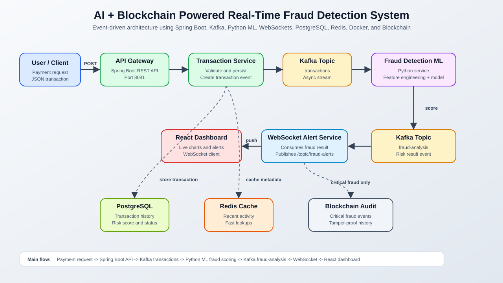

# AI + Blockchain Powered Real-Time Fraud Detection System

## 1. Project Overview

The **AI + Blockchain Powered Real-Time Fraud Detection System** is a real-time payment fraud detection platform. It receives payment transactions, processes them through a backend system, sends events through Kafka, analyzes fraud risk using a Python-based machine learning service, updates a live React dashboard using WebSockets, and stores critical fraud events on blockchain for tamper-proof audit history.

This project is useful because payment fraud needs to be detected quickly. A delayed fraud response can lead to financial loss, poor customer experience, and weak audit traceability.

## 2. Problem Statement

Digital payment systems process large numbers of transactions every second. Some transactions may be fraudulent due to unusual amount, suspicious location, unknown device, risky merchant, or abnormal user behavior.

Traditional manual fraud detection is slow because:

- Humans cannot review every transaction in real time.
- Fraud patterns change quickly.
- Manual checks can delay genuine payments.
- Audit records can be modified if they are stored only in centralized systems.

## 3. Solution

This system solves the problem using a real-time, event-driven architecture.

- **Spring Boot APIs** receive and validate transactions.
- **Apache Kafka** streams transaction events asynchronously.
- **Python ML service** predicts fraud probability and generates a risk score.
- **WebSockets** push live fraud alerts to the dashboard.
- **PostgreSQL** stores transaction history.
- **Blockchain** stores critical fraud events as tamper-proof audit records.
- **Docker** helps run infrastructure services consistently.

## 4. End-to-End Flow

Sample transaction:

```json
{
  "transactionId": "TXN1001",
  "userId": "USER101",
  "amount": 120000,
  "merchant": "Amazon",
  "location": "Russia",
  "deviceId": "DEV999",
  "timestamp": "2026-05-17T10:15:00"
}
```

Complete flow:

1. User makes a payment.
2. API Gateway receives the transaction request.
3. Transaction Service validates the transaction data.
4. Transaction Service stores the transaction in PostgreSQL.
5. Kafka Producer publishes the transaction event to a Kafka topic.
6. Fraud Detection ML Service consumes the Kafka event.
7. ML model analyzes amount, merchant, location, device ID, timestamp, and risk patterns.
8. Risk score is generated.
9. Fraud result is published back to Kafka.
10. WebSocket Alert Service consumes the fraud result.
11. React Dashboard receives the alert through WebSocket.
12. Dashboard updates transaction status, fraud score, and alert charts in real time.
13. Critical fraud events are stored on blockchain for audit history.
14. PostgreSQL keeps transaction and fraud history for reporting and lookup.

## 5. Microservices / Components

### API Gateway

Receives transaction requests from users or payment clients and exposes REST APIs for the system.

### Transaction Service

Validates transaction details, stores records in PostgreSQL, and prepares transaction events for Kafka.

### Kafka Producer

Publishes transaction events to Kafka so other services can process them asynchronously.

### Kafka Consumer

Consumes Kafka events from topics such as transaction events and fraud analysis results.

### Fraud Detection ML Service

A Python-based service that reads transaction events, applies feature engineering, runs the ML model, and predicts fraud probability.

### PostgreSQL Database

Stores transaction records, fraud status, risk scores, timestamps, user metadata, and payment metadata.

### Redis Cache

Can be used to cache recent transaction activity, device usage, user risk profiles, and frequently accessed fraud metadata.

### WebSocket Alert Service

Pushes fraud detection results to connected dashboard clients in real time.

### React Dashboard

Displays live transaction alerts, fraud scores, status summaries, and charts.

### Blockchain Audit Service

Stores only critical fraud events on blockchain to maintain a tamper-proof audit trail.

## 6. Architecture Explanation

The system follows an **event-driven architecture** using Apache Kafka.

Instead of every service directly calling another service, services communicate through events. When a transaction is created, it is published to Kafka. The fraud detection service consumes that event, processes it independently, and publishes a fraud result event. This makes the system scalable, loosely coupled, and suitable for real-time processing.

### System Architecture Flow



## 7. Why Kafka is Used

Kafka is used as the real-time event streaming layer.

Kafka helps with:

- **Asynchronous communication** between backend and ML services.
- **Scalability**, because multiple consumers can process events.
- **Fault tolerance**, because events can be retained and replayed.
- **Real-time streaming**, which is important for fast fraud detection.
- **Loose coupling**, so services do not depend directly on each other.

## 8. Why Machine Learning is Used

Machine learning helps detect suspicious transactions automatically.

The ML model can analyze features such as:

- Transaction amount
- Merchant
- Location
- Device ID
- Timestamp
- User behavior patterns

Based on these features, the model generates a fraud risk score. Higher scores indicate more suspicious transactions.

## 9. Why Blockchain is Used

Blockchain is used only for **critical fraud events**, not for every transaction.

This keeps the system efficient while still providing strong audit protection. Once a critical fraud record is written to blockchain, it becomes difficult to modify or delete. This helps with compliance, investigation, and fraud audit history.

## 10. Database Design

PostgreSQL stores the main transaction and fraud records.

Typical stored data includes:

- Transaction ID
- User ID
- Amount
- Merchant
- Location
- Device ID
- Timestamp
- Fraud status
- Risk score
- Created and updated timestamps
- User and payment metadata

## 11. Real-Time Dashboard

The React dashboard receives live fraud alerts using WebSockets.

It can display:

- Transaction ID
- User ID
- Fraud score
- Fraud or safe status
- Live alert list
- Risk score chart
- Summary of safe and suspicious transactions

WebSockets are used because they allow the backend to push updates instantly without requiring the frontend to repeatedly call APIs.

## 12. Docker Setup

Docker is used to run infrastructure and services in isolated containers.

Common Dockerized services include:

- Kafka
- Zookeeper
- PostgreSQL
- Redis
- Fraud Detection ML Service
- Other backend services

Docker makes the setup easier to run across different machines and avoids environment mismatch issues.

## 13. Key Features

- Real-time transaction processing
- Kafka-based event streaming
- ML-based fraud prediction
- WebSocket live alerts
- PostgreSQL transaction storage
- Blockchain-based fraud audit
- Scalable microservice architecture
- Dockerized setup

## 14. Learning Outcomes

This project demonstrates practical skills in:

- Backend development
- Microservices
- Apache Kafka
- Real-time systems
- Machine learning integration
- Database design
- WebSocket communication
- Docker
- Blockchain basics
- System design

## 15. Future Enhancements

Possible future improvements:

- JWT authentication
- API rate limiting
- Admin dashboard
- Advanced ML model
- Model retraining pipeline
- Kubernetes deployment
- Cloud deployment
- Monitoring with Prometheus and Grafana

## Summary

This project combines backend engineering, real-time streaming, machine learning, dashboard visualization, database storage, and blockchain audit logging into one end-to-end fraud detection system. It is designed to detect suspicious transactions quickly, alert users in real time, and preserve critical fraud records securely.
